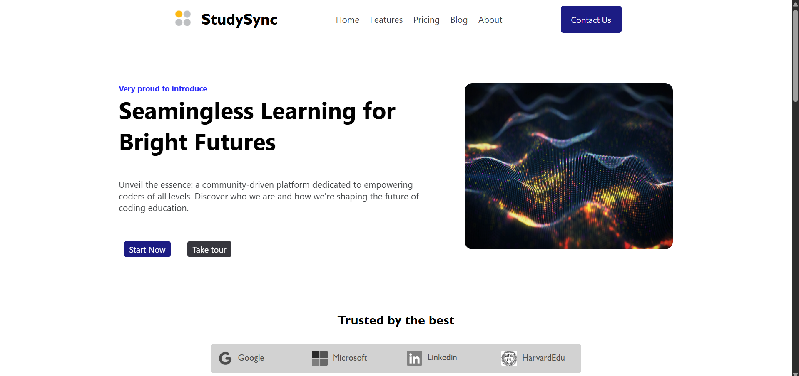

# StudySync 🌐

Welcome to **StudySync**, a responsive and modern educational landing page built with **HTML and CSS only**. It's a beginner project designed as part of my journey in learning web development.

---

## Website link

https://study-sync-bice.vercel.app/

---

## 🚀 Project Overview

> “Seamless Learning for Bright Futures”

**StudySync** is a fictional website landing page introducing a collaborative e-learning platform. The interface showcases a clean layout, modern UI structure, and mobile responsiveness. This project uses **pure HTML and CSS**, with no frameworks or JavaScript.

🌟 Features:

- Fully responsive navbar (with media queries)
- Hero section with CTA buttons
- Trusted companies showcase
- Feature cards section
- Testimonials from users
- Newsletter subscription form
- Footer with links and social icons
- Accessible & semantic HTML tags

---

*Note: Make sure all images are uploaded to GitHub with your HTML and CSS files, inside an `assets` folder or the main directory depending on your referencing.*

---

## 🛠 Technologies Used

- HTML5
- CSS3 (Flexbox, Grid, Media Queries)
- Icons and images used from local assets (not from external CDN)

---

## Screenshots

---

## 📱 Responsive Design

This site is **fully responsive** and adapts to different screen widths using CSS Media Queries. The navbar collapses into a mobile-style menu on smaller screens and hides certain elements for a better experience.

---

## 🎯 Purpose

This was my **very first web development project**, built while learning the basics of HTML and CSS. The goals of this project were:

- To understand HTML structure and semantic tags.
- To get hands-on with CSS styling, layouts, and responsiveness.
- To practice building from scratch without frameworks.

I'm still learning, and this project was a great way to reinforce my understanding of how websites are built. 😊

---

## 🚧 Limitations & To-Do

- No actual backend or JavaScript functionality (buttons/forms don't work yet).
- Images are for UI visuals only — not optimized.
- No GitHub Pages deployment yet (coming soon).
- Some typos and content will be fixed in the next version.

---

## 💪 What's Next

- Add JavaScript for mobile menu toggle and form validation.
- Connect the email form to an actual service like FormSubmit or Netlify Forms.
- Refactor HTML/CSS as I learn best practices.
- Deploy a live version using GitHub Pages.

---

## 💬 Connect With Me

If you have feedback, tips, or you just want to say hi:

- 📧 Email: kishlay4305t@example.com
- 💼 LinkedIn: www.linkedin.com/in/kishlay-tejeswi

---
## Notes
- This is my first project and I'm still learning. Feedback and suggestions are welcome!
- All images are stored in the `public` folder.

---

## 📄 License

This project is open for learning and contributions. No license needed. Feel free to fork and improve it if you’re learning too!

---

### ✨ Special Thanks

Huge thanks to the online coding tutorials and community that helped me get started 🚀. This marks the beginning of my *web dev* journey!

---

### 🌱 Made with love & learning ❤️

